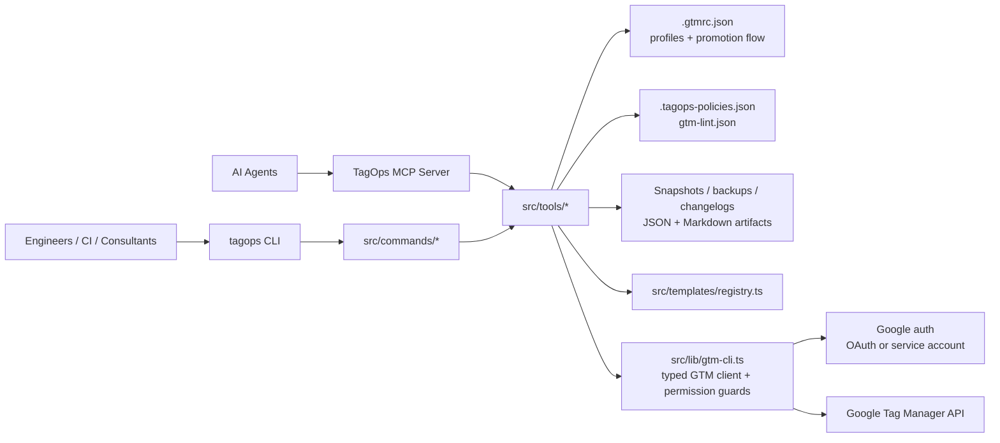

# TagOps

[](https://github.com/gtm-auto/gtm-auto/actions/workflows/ci.yml)
[](https://www.npmjs.com/package/tagops)
[](LICENSE)

**Ship Google Tag Manager like code.**

TagOps is an opinionated Infrastructure-as-Code CLI for Google Tag Manager with snapshots, restore plans, policy packs, drift detection, multi-container promotion, integration templates, and MCP tooling for AI agents.

## Table of Contents

- [Why TagOps](#why-tagops)
- [Quick Start](#quick-start)
- [Command Reference](#command-reference)
- [Architecture](#architecture)
- [Profiles & Environments](#profiles--environments)
- [Policy Packs](#policy-packs)
- [MCP Integration](#mcp-integration)
- [Contributing](#contributing)
- [License](#license)

## Why TagOps

- **Safe GTM change management.** Snapshot live containers, diff them, preview restore plans with risk levels, and restore deliberately instead of making blind API mutations.
- **Built-in governance.** Audit consent, enforce policy packs, lint naming and custom HTML rules, score container health, and fail CI when standards are violated.
- **Real multi-environment workflows.** Use profiles for staging and production, compare containers side by side, sync safely, and enforce promotion flow rules.
- **Operator and agent friendly.** Human-readable reports, Markdown artifacts, webhook notifications, and an MCP server all sit on top of the same typed GTM library.

## Quick Start

**Prerequisites**

- Node.js `18+`
- A GTM account, container, and workspace ID
- Google auth via a service account JSON key or browser OAuth

**First snapshot in under 60 seconds**

```bash
npm install -g tagops

tagops init --account-id 123456789 --container-id 987654321 --workspace-id 1

export GOOGLE_APPLICATION_CREDENTIALS="$PWD/service-account.json"
tagops auth login --key-file "$GOOGLE_APPLICATION_CREDENTIALS"

tagops snapshot
```

Then verify everything is wired correctly:

```bash
tagops status
tagops auth whoami
tagops diff --snapshot gtm-snapshot.json
```

If your team prefers browser auth instead of a service account:

```bash
tagops auth login
```

## Command Reference

**Global options**

| Option             | What it does                                                | Example                          |
| ------------------ | ----------------------------------------------------------- | -------------------------------- |
| `--json`           | Emit machine-readable JSON for scripting and CI.            | `tagops --json health-score`     |
| `--profile <name>` | Run any command against a named profile from `.gtmrc.json`. | `tagops --profile staging audit` |
| `--version`        | Print the CLI version.                                      | `tagops --version`               |
| `--help`           | Show help for the CLI or any command.                       | `tagops workspace --help`        |

Many commands intentionally exit non-zero when they should fail a gate, including `policy-check`, `lint`, `consent-audit --score-only`, `doctor`, `health-score`, `test-datalayer`, and `validate-capi`.

### Core IaC

| Command                        | Description                                                                                                                                      | Key flags                                                         | Example                                                                |
| ------------------------------ | ------------------------------------------------------------------------------------------------------------------------------------------------ | ----------------------------------------------------------------- | ---------------------------------------------------------------------- |
| `tagops snapshot`              | Save a full GTM workspace snapshot including tags, triggers, variables, folders, built-in variables, environments, clients, and transformations. | `--output <file>`                                                 | `tagops snapshot --output snapshots/prod.json`                         |
| `tagops diff`                  | Compare the current workspace to a saved snapshot.                                                                                               | `--snapshot <file>`                                               | `tagops diff --snapshot snapshots/prod.json`                           |
| `tagops plan <snapshot>`       | Build a restore plan before applying a snapshot and classify the change risk as `low`, `medium`, `high`, or `critical`.                          | none                                                              | `tagops plan snapshots/prod.json`                                      |
| `tagops changelog`             | Generate a stakeholder-friendly changelog between two snapshots or a snapshot and the current workspace.                                         | `--from <file>`, `--to <file>`, `--output <file>`                 | `tagops changelog --from old.json --to new.json --output CHANGELOG.md` |
| `tagops restore <file>`        | Restore the workspace from a snapshot, with plan preview and confirmation for risky restores.                                                    | `--dry-run`, `--delete`                                           | `tagops restore snapshots/prod.json --dry-run`                         |
| `tagops publish`               | Create a GTM version and optionally publish it live. Without `--confirm`, it only creates the version.                                           | `--name <name>`, `--description <text>`, `--confirm`, `--dry-run` | `tagops publish --name "Release 2026-03-19" --confirm`                 |
| `tagops versions`              | List recent GTM container versions.                                                                                                              | `--limit <n>`                                                     | `tagops versions --limit 20`                                           |
| `tagops rollback <version-id>` | Re-publish a historical GTM version, with optional dry-run preview.                                                                              | `--dry-run`                                                       | `tagops rollback 42 --dry-run`                                         |
| `tagops undo`                  | Restore the latest pre-fix backup created by repair commands like `fix-firing` or `consent-audit --fix`.                                         | `--list`                                                          | `tagops undo --list`                                                   |

### Governance

| Command                | Description                                                                                                                         | Key flags                              | Example                                              |
| ---------------------- | ----------------------------------------------------------------------------------------------------------------------------------- | -------------------------------------- | ---------------------------------------------------- |
| `tagops audit`         | Audit a workspace for missing triggers, consent issues, duplicate tags, orphaned triggers, risky custom HTML, bad naming, and more. | `--fix`                                | `tagops audit --fix`                                 |
| `tagops consent-audit` | Run a deep Consent Mode v2 audit with a compliance score and optional remediation.                                                  | `--fix`, `--dry-run`, `--score-only`   | `tagops consent-audit --score-only`                  |
| `tagops policy-check`  | Evaluate a policy pack against a live GTM workspace.                                                                                | `--config <file>`                      | `tagops policy-check --config .tagops-policies.json` |
| `tagops lint`          | Run a simpler configurable linter against a live workspace or a snapshot.                                                           | `--config <file>`, `--snapshot <file>` | `tagops lint --snapshot gtm-snapshot.json`           |
| `tagops report`        | Generate a professional Markdown quality report that combines health scoring and audit findings.                                    | `--output <path>`                      | `tagops report --output reports/client-q1.md`        |

### Validation & Migration

| Command                       | Description                                                                                          | Key flags                                                                                           | Example                                                                                        |
| ----------------------------- | ---------------------------------------------------------------------------------------------------- | --------------------------------------------------------------------------------------------------- | ---------------------------------------------------------------------------------------------- |
| `tagops enhanced-conversions` | Validate Google Ads enhanced conversions for user-data tag presence, trigger alignment, and consent. | none                                                                                                | `tagops enhanced-conversions`                                                                  |
| `tagops sst-readiness`        | Assess readiness for server-side tagging or audit an existing server container.                      | none                                                                                                | `tagops sst-readiness`                                                                         |
| `tagops validate-datalayer`   | Validate captured `dataLayer` pushes against standard ecommerce event schemas.                       | `--captured <file>`, `--capture-script`, `--events <list>`                                          | `tagops validate-datalayer --captured datalayer-capture.json --events purchase,begin_checkout` |
| `tagops test-datalayer`       | Use a headless browser to exercise a page and validate captured pushes against a JSON schema.        | `--url <url>`, `--schema <path>`, `--event <name>`, `--click <selector>`, `--delay <ms>`, `--debug` | `tagops test-datalayer --url https://example.com --event purchase --click ".buy-now"`          |
| `tagops validate-capi`        | Validate Meta Conversions API or TikTok Events API payloads offline.                                 | `--platform <meta\|tiktok>`, `--payload <path>`                                                     | `tagops validate-capi --platform meta --payload payloads/purchase.json`                        |

### Multi-Container

| Command           | Description                                                                                                               | Key flags                                                                       | Example                                                         |
| ----------------- | ------------------------------------------------------------------------------------------------------------------------- | ------------------------------------------------------------------------------- | --------------------------------------------------------------- |
| `tagops profiles` | List named profiles from `.gtmrc.json`.                                                                                   | none                                                                            | `tagops profiles`                                               |
| `tagops compare`  | Compare two GTM containers side by side using named profiles.                                                             | `--source <profile>`, `--target <profile>`                                      | `tagops compare --source staging --target production`           |
| `tagops sync`     | Sync tags, triggers, and variables from a source profile to a target profile with dependency remapping.                   | `--source <profile>`, `--target <profile>`, `--dry-run`, `--force`              | `tagops sync --source production --target staging --dry-run`    |
| `tagops promote`  | Enforce environment promotion flow, print a promotion plan, sync changes, and optionally publish in the target container. | `--source <profile>`, `--target <profile>`, `--publish`, `--dry-run`, `--force` | `tagops promote --source staging --target production --dry-run` |

### Workspace

| Command                          | Description                                                                             | Key flags                  | Example                                                                            |
| -------------------------------- | --------------------------------------------------------------------------------------- | -------------------------- | ---------------------------------------------------------------------------------- |
| `tagops workspace list`          | List draft workspaces in the current container.                                         | none                       | `tagops workspace list`                                                            |
| `tagops workspace status`        | Show whether the current workspace is synced, plus merge conflicts and pending changes. | none                       | `tagops workspace status`                                                          |
| `tagops workspace create <name>` | Create a new isolated draft workspace.                                                  | `-d, --description <text>` | `tagops workspace create "Q2 Consent Fixes" --description "Review-only workspace"` |
| `tagops workspace select <id>`   | Update `.gtmrc.json` to point the CLI at another workspace ID.                          | none                       | `tagops workspace select 12`                                                       |
| `tagops workspace sync`          | Sync the current draft workspace with the latest container version.                     | none                       | `tagops workspace sync`                                                            |
| `tagops workspace delete <id>`   | Delete a draft workspace.                                                               | none                       | `tagops workspace delete 12`                                                       |

### Monitoring

| Command                   | Description                                                                                          | Key flags                                                                   | Example                                                                                           |
| ------------------------- | ---------------------------------------------------------------------------------------------------- | --------------------------------------------------------------------------- | ------------------------------------------------------------------------------------------------- |
| `tagops status`           | Run a quick health check for config, auth, counts, and last backup.                                  | none                                                                        | `tagops status`                                                                                   |
| `tagops watch`            | Poll GTM continuously, compare against a live baseline, and optionally send webhook alerts on drift. | `--interval <minutes>`, `--webhook <url>`, `--managed-only`                 | `tagops watch --interval 5 --managed-only --webhook https://hooks.slack.com/...`                  |
| `tagops drift <snapshot>` | Compare a saved snapshot with the live workspace and classify changes as managed or unmanaged.       | none                                                                        | `tagops drift gtm-snapshot.json`                                                                  |
| `tagops health-score`     | Calculate a composite `0-100` container health score with a letter grade.                            | none                                                                        | `tagops health-score`                                                                             |
| `tagops notify`           | Send a Slack or Teams webhook notification for audit, publish, drift, snapshot, or custom events.    | `--webhook <url>`, `--event <type>`, `--message <text>`, `--score <number>` | `tagops notify --webhook https://hooks.slack.com/... --event publish --message "Release 42 live"` |

### Templates

TagOps ships with **20 built-in templates** spanning Meta, Google Ads, TikTok, Pinterest, Reddit, Taboola, Klaviyo, Shopify Custom Pixel, Impact.com, Retention.com, Magellan AI, and more.

| Command                            | Description                                                                                   | Key flags                                               | Example                                                                |
| ---------------------------------- | --------------------------------------------------------------------------------------------- | ------------------------------------------------------- | ---------------------------------------------------------------------- |
| `tagops templates list`            | List available integration templates.                                                         | none                                                    | `tagops templates list`                                                |
| `tagops templates preview <name>`  | Preview the exact tags and HTML a template would generate.                                    | `--pixel-id <id>`, `--measurement-id <id>`              | `tagops templates preview meta-pixel --pixel-id 1234567890`            |
| `tagops templates install <name>`  | Install a template into the current GTM workspace.                                            | `--dry-run`, `--pixel-id <id>`, `--measurement-id <id>` | `tagops templates install tiktok-pixel --pixel-id CXXXXXXXX --dry-run` |
| `tagops templates validate <name>` | Validate installed tags against a template definition to detect drift or incomplete installs. | `--pixel-id <id>`, `--measurement-id <id>`              | `tagops templates validate meta-pixel --pixel-id 1234567890`           |
| `tagops deploy [manifest]`         | Batch install templates from a `deploy.json` manifest.                                        | `--dry-run`, `--init`                                   | `tagops deploy --init`                                                 |

`templates preview` is the safest way to review generated HTML before writing. Some GA4-native templates are intentionally preview-oriented and may still require finishing steps in the GTM UI.

### Docs & Ops

| Command          | Description                                                                                                | Key flags                              | Example                                                                |
| ---------------- | ---------------------------------------------------------------------------------------------------------- | -------------------------------------- | ---------------------------------------------------------------------- |
| `tagops backup`  | Export tags, triggers, and variables to a timestamped backup directory.                                    | `--output-dir <dir>`                   | `tagops backup --output-dir ./backups`                                 |
| `tagops cleanup` | Find paused tags, orphaned triggers, and unused variables, then optionally delete them interactively.      | `--scan-only`                          | `tagops cleanup --scan-only`                                           |
| `tagops docgen`  | Generate a Markdown data dictionary for tags, triggers, variables, data layer keys, and consent groupings. | `--output <file>`                      | `tagops docgen --output docs/gtm-dictionary.md`                        |
| `tagops graph`   | Generate a Mermaid dependency graph of tags, triggers, and variable references.                            | `--output <file>`, `--snapshot <file>` | `tagops graph --snapshot gtm-snapshot.json --output docs/gtm-graph.md` |
| `tagops init-ci` | Scaffold GitHub Actions workflows for PR checks, deploys, and scheduled drift detection.                   | `--branch <name>`                      | `tagops init-ci --branch main`                                         |
| `tagops ui`      | Launch the local dashboard if the UI build is available.                                                   | `-p, --port <number>`                  | `tagops ui --port 4000`                                                |

### Safety & Auth

| Command              | Description                                                                                                                 | Key flags                                                         | Example                                                            |
| -------------------- | --------------------------------------------------------------------------------------------------------------------------- | ----------------------------------------------------------------- | ------------------------------------------------------------------ |
| `tagops init`        | Create `.gtmrc.json` for the current GTM container.                                                                         | `--account-id <id>`, `--container-id <id>`, `--workspace-id <id>` | `tagops init --account-id 123 --container-id 456 --workspace-id 1` |
| `tagops auth login`  | Authenticate via browser OAuth or validate a service account key path.                                                      | `--key-file <path>`                                               | `tagops auth login --key-file ./service-account.json`              |
| `tagops auth import` | Import credentials from `@owntag/gtm-cli` if you already use it.                                                            | none                                                              | `tagops auth import`                                               |
| `tagops auth status` | Check current Google API authentication status.                                                                             | none                                                              | `tagops auth status`                                               |
| `tagops auth whoami` | Show the authenticated Google identity and effective GTM permission level.                                                  | none                                                              | `tagops auth whoami`                                               |
| `tagops doctor`      | Run full diagnostics for Node version, config, auth, API connectivity, permissions, resource health, and consent readiness. | none                                                              | `tagops doctor`                                                    |

### Advanced & Legacy Repair

| Command               | Description                                                              | Key flags                                  | Example                                                        |
| --------------------- | ------------------------------------------------------------------------ | ------------------------------------------ | -------------------------------------------------------------- |
| `tagops fix-consent`  | Update consent settings on specific tags.                                | `--tag-ids <ids>`, `--consent-type <type>` | `tagops fix-consent --tag-ids 6,115 --consent-type ad_storage` |
| `tagops fix-triggers` | Reattach missing firing triggers using a JSON mapping file.              | `--mapping <file>`                         | `tagops fix-triggers --mapping trigger-map.json`               |
| `tagops fix-firing`   | Detect and fix unlimited firing on tags, especially for SPA storefronts. | `--dry-run`, `--option <value>`            | `tagops fix-firing --dry-run`                                  |
| `tagops create-pixel` | Create custom HTML pixel tags from a JSON config file.                   | `--config <file>`                          | `tagops create-pixel --config pixels.json`                     |

## Architecture



TagOps is intentionally modular:

- `src/commands/*` defines the CLI surface.
- `src/tools/*` implements the actual workflows.
- `src/lib/*` holds the shared GTM client, config loading, auth, policies, and permission guards.
- `src/templates/registry.ts` is the built-in template catalog.
- `src/server.ts` exposes the same core capabilities over MCP.

## Profiles & Environments

Use `.gtmrc.json` to model multi-container workflows across development, staging, and production.

```json
{
  "accountId": "123456789",
  "containerId": "111111111",
  "workspaceId": "1",
  "promotionFlow": ["development", "staging", "production"],
  "profiles": [
    {
      "name": "development",
      "accountId": "123456789",
      "containerId": "111111111",
      "workspaceId": "2",
      "environment": "development"
    },
    {
      "name": "staging",
      "accountId": "123456789",
      "containerId": "222222222",
      "workspaceId": "3",
      "environment": "staging"
    },
    {
      "name": "production",
      "accountId": "123456789",
      "containerId": "333333333",
      "workspaceId": "4",
      "environment": "production"
    }
  ]
}
```

**How it works**

- `tagops --profile <name> <command>` overlays the base config with the named profile.
- `tagops compare` shows cross-container drift before a promotion.
- `tagops sync` copies create and update changes from source to target, remapping variable references in triggers and trigger IDs in tags.
- `tagops promote` enforces adjacent environment transitions only. With the default flow, `development -> staging -> production` is valid, while `development -> production` is rejected.

**Example workflow**

```bash
tagops --profile development snapshot --output snapshots/dev.json
tagops compare --source development --target staging
tagops promote --source development --target staging --dry-run
tagops promote --source staging --target production --publish
```

Promotion is intentionally conservative: target-only resources are reported as drift and left untouched for manual review.

## Policy Packs

`tagops policy-check` reads `.tagops-policies.json` by default and evaluates a richer rule set than the simpler `gtm-lint.json` linter.

**Built-in policies**

- `consent-v2-advertising`
- `consent-v2-analytics`
- `spa-firing-safety`
- `no-document-write`
- `meta-dedup`
- `naming-convention`
- `no-orphaned-triggers`
- `vendor-consent-matrix`

**Example policy pack**

```json
{
  "enabledPolicies": [
    "consent-v2-advertising",
    "meta-dedup",
    "spa-firing-safety",
    "vendor-consent-matrix"
  ],
  "naming": {
    "tagPrefixes": ["GA4", "Meta", "TikTok", "Reddit"],
    "triggerPattern": "^(CE|PV|Click|History)\\s[-–]\\s",
    "tagPattern": "^[A-Za-z0-9][A-Za-z0-9 ]*\\s[-–]\\s"
  },
  "vendorConsentMatrix": {
    "Meta": ["ad_storage"],
    "TikTok": ["ad_storage"],
    "GA4": ["analytics_storage"]
  },
  "customPolicies": [
    {
      "id": "meta-html-must-dedup",
      "name": "Meta HTML Must Deduplicate",
      "description": "Meta HTML tags must contain eventID or event_id.",
      "severity": "error",
      "category": "vendor",
      "target": "tag",
      "match": {
        "vendorIn": ["meta"],
        "typeIn": ["html"]
      },
      "require": {
        "eventId": true
      }
    }
  ]
}
```

**Run it**

```bash
tagops policy-check
tagops policy-check --config policies/production.json
```

Policy packs are designed for CI gates: error-severity violations fail the command, while warnings and info remain visible without blocking deployment.

## MCP Integration

TagOps includes an MCP server in [`src/server.ts`](src/server.ts) so AI agents can inspect GTM state, run audits, compare environments, preview templates, and safely assist with implementation.

**What the MCP server exposes**

- Inventory tools: `gtm_list_tags`, `gtm_get_tag`, `gtm_list_triggers`, `gtm_list_variables`
- Governance tools: `gtm_audit`, `gtm_consent_audit`, `gtm_doctor`, `gtm_health_score`
- Validation tools: `gtm_enhanced_conversions`, `gtm_sst_readiness`, `gtm_test_datalayer`, `gtm_validate_capi`
- Multi-container tools: `gtm_compare_containers`, `gtm_sync_containers`
- Template tools: `gtm_list_templates`, `gtm_preview_template`, `gtm_install_template`
- Build tools: `gtm_create_html_tag`, `gtm_create_trigger`, `gtm_implement_pixel`
- Utilities: `gtm_notify`, `gtm_get_architecture`, plus the `gtm://architecture` resource

**Safety model**

- Start with `--read-only` to disable write operations entirely.
- Even in write-enabled mode, custom HTML creation is sanitized against dangerous patterns and untrusted external domains.
- MCP `gtm_consent_audit` fixes are dry-run only for safety.

**Run the server from the repo**

```bash
npm install
npm run build
node dist/server.js --read-only
```

**Example MCP client config**

```json
{
  "mcpServers": {
    "tagops": {
      "command": "node",
      "args": ["/absolute/path/to/GTMCLIAUTOMATION/dist/server.js", "--read-only"],
      "env": {
        "GOOGLE_APPLICATION_CREDENTIALS": "/absolute/path/to/service-account.json"
      }
    }
  }
}
```

For local development you can also run:

```bash
npm run server
```

## Contributing

Contributions are welcome, especially around GTM workflows, policy coverage, templates, documentation, and MCP ergonomics.

**Local setup**

```bash
git clone https://github.com/gtm-auto/gtm-auto.git
cd gtm-auto
npm install
```

**Useful commands**

```bash
npm run dev -- --help
npm run typecheck
npm run lint
npm test
npm run build
```

**Project layout**

- [`src/cli.ts`](src/cli.ts): CLI entrypoint
- [`src/commands`](src/commands): command registration
- [`src/tools`](src/tools): workflow implementations
- [`src/templates/registry.ts`](src/templates/registry.ts): built-in integration templates
- [`src/server.ts`](src/server.ts): MCP server

If you add or change CLI behavior, update the README and any relevant examples in the same PR.

## License

MIT. See [LICENSE](LICENSE).
